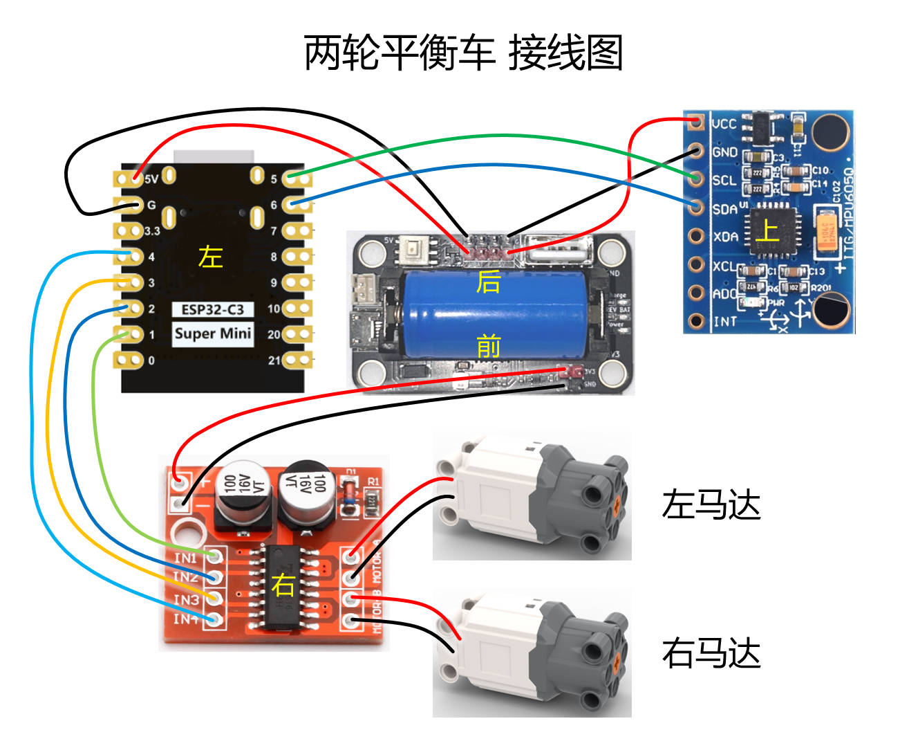

# 两轮平衡车代码

### 以下需要修改成你自己的

bcar-arduino.ino
```c++
// wifi 名称和路由
const char *ssid = "你的 WIFI 名称";
const char *password = "你的 WIFI 密码";

// 设置静态 IP 配置
IPAddress local_ip(192, 168, x, 180);  // 设置固定 IP 地址, x 替换成你的路由中设置的值
IPAddress gateway(192, 168, x, 1);     // 路由器网关地址, x 替换成你的路由中设置的值
```

index.html
```html
const esp32Address = "http://192.168.x.180"  // x 替换成你的路由中设置的值

```





